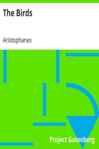

# The Birds <kbd>3013</kbd>

## Authors

 - Aristophanes <small>(-450 - -388)</small>

## Subjects

 - Aristophanes -- Translations into English
 - Athens (Greece) -- Social life and customs -- Drama
 - Birds -- Drama
 - Comedies
 - Gods, Greek -- Drama
 - Greek drama (Comedy) -- Translations into English
 - Imaginary societies -- Drama

## Download

 - https://www.gutenberg.org/ebooks/3013.txt.utf-8
 - https://www.gutenberg.org/ebooks/3013.kindle.images
 - https://www.gutenberg.org/ebooks/3013.epub.images
 - https://www.gutenberg.org/ebooks/3013.rdf
 - https://www.gutenberg.org/files/3013/3013.txt
 - https://www.gutenberg.org/cache/epub/3013/pg3013.cover.small.jpg
 - https://www.gutenberg.org/ebooks/3013.html.images
 - https://www.gutenberg.org/files/3013/3013-h.zip

## Book Shelves

 - Banned Books from Anne Haight's list
 - Classical Antiquity
 - One Act Plays
