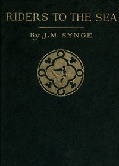

# Riders to the Sea <kbd>994</kbd>

## Authors

 - Synge, J. M. (John Millington) <small>(1871 - 1909)</small>

## Subjects

 - Drowning victims -- Drama
 - Ireland -- Drama
 - Mothers and sons -- Drama
 - Seafaring life -- Drama

## Download

 - https://www.gutenberg.org/files/994/994-h.zip
 - https://www.gutenberg.org/cache/epub/994/pg994.cover.small.jpg
 - https://www.gutenberg.org/files/994/994-0.txt
 - https://www.gutenberg.org/files/994/994.txt
 - https://www.gutenberg.org/files/994/994-0.zip
 - https://www.gutenberg.org/ebooks/994.html.images
 - https://www.gutenberg.org/ebooks/994.kindle.images
 - https://www.gutenberg.org/ebooks/994.rdf
 - https://www.gutenberg.org/ebooks/994.epub.images

## Book Shelves

 - One Act Plays
 - Opera
