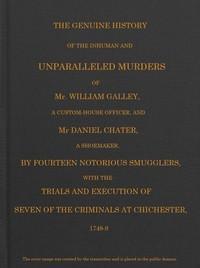

# Smuggling & Smugglers in Sussex: The Genuine History of the Inhuman and Unparalleled Murders of Mr. William Galley a Custom-house Officer, and Mr. Daniel Chater, a Shoemaker, by Fourteen Notorious Smugglers, with the Trials and Execution of Seven of the Criminals at Chichester, 1748-9 <kbd>67468</kbd>

## Authors

 - Anonymous <small>(null - null)</small>

## Subjects

 - Crime -- England -- History
 - Smuggling -- England -- Sussex -- History

## Download

 - https://www.gutenberg.org/files/67468/67468-0.zip
 - https://www.gutenberg.org/files/67468/67468-h.zip
 - https://www.gutenberg.org/cache/epub/67468/pg67468.cover.small.jpg
 - https://www.gutenberg.org/ebooks/67468.txt.utf-8
 - https://www.gutenberg.org/ebooks/67468.html.images
 - https://www.gutenberg.org/ebooks/67468.rdf
 - https://www.gutenberg.org/ebooks/67468.kindle.images
 - https://www.gutenberg.org/ebooks/67468.epub.images
 - https://www.gutenberg.org/files/67468/67468-0.txt

## Book Shelves

