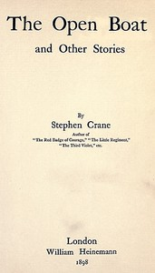

# The Open Boat and Other Stories <kbd>45524</kbd>

## Authors

 - Crane, Stephen <small>(1871 - 1900)</small>

## Subjects

 - Short stories, American
 - United States -- Social life and customs -- 19th century -- Fiction

## Download

 - https://www.gutenberg.org/ebooks/45524.html.images
 - https://www.gutenberg.org/files/45524/45524-h.zip
 - https://www.gutenberg.org/cache/epub/45524/pg45524.cover.small.jpg
 - https://www.gutenberg.org/files/45524/45524-0.txt
 - https://www.gutenberg.org/ebooks/45524.kindle.images
 - https://www.gutenberg.org/ebooks/45524.txt.utf-8
 - https://www.gutenberg.org/ebooks/45524.rdf
 - https://www.gutenberg.org/ebooks/45524.epub.images

## Book Shelves

