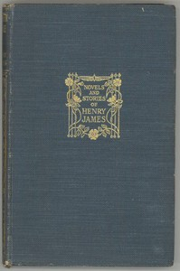

# Washington Square <kbd>2870</kbd>

## Authors

 - James, Henry <small>(1843 - 1916)</small>

## Subjects

 - Domestic fiction
 - Fathers and daughters -- Fiction
 - Love stories
 - Washington Square (New York, N.Y.) -- Fiction
 - Young women -- Fiction

## Download

 - https://www.gutenberg.org/ebooks/2870.html.images
 - https://www.gutenberg.org/cache/epub/2870/pg2870.cover.small.jpg
 - https://www.gutenberg.org/files/2870/2870-h.zip
 - https://www.gutenberg.org/files/2870/2870-0.txt
 - https://www.gutenberg.org/ebooks/2870.rdf
 - https://www.gutenberg.org/ebooks/2870.epub.images
 - https://www.gutenberg.org/ebooks/2870.kindle.images

## Book Shelves

