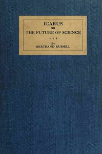

# Icarus; or, The Future of Science <kbd>66225</kbd>

## Authors

 - Russell, Bertrand <small>(1872 - 1970)</small>

## Subjects

 - Civilization
 - Science
 - Science and state

## Download

 - https://www.gutenberg.org/files/66225/66225-h/66225-h.htm
 - https://www.gutenberg.org/files/66225/66225-0.zip
 - https://www.gutenberg.org/cache/epub/66225/pg66225.cover.small.jpg
 - https://www.gutenberg.org/ebooks/66225.txt.utf-8
 - https://www.gutenberg.org/ebooks/66225.rdf
 - https://www.gutenberg.org/files/66225/66225-0.txt
 - https://www.gutenberg.org/ebooks/66225.epub.images
 - https://www.gutenberg.org/ebooks/66225.kindle.images

## Book Shelves

