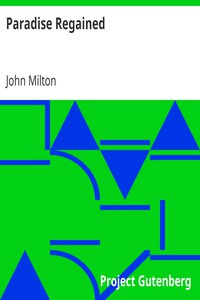

# Paradise Regained <kbd>58</kbd>

## Authors

 - Milton, John <small>(1608 - 1674)</small>

## Subjects

 - Bible. Gospels -- History of Biblical events -- Poetry
 - English poetry
 - Epic poetry
 - Jesus Christ -- Temptation -- Poetry

## Download

 - https://www.gutenberg.org/files/58/58-0.zip
 - https://www.gutenberg.org/files/58/58-0.txt
 - https://www.gutenberg.org/ebooks/58.html.images
 - https://www.gutenberg.org/cache/epub/58/pg58.cover.medium.jpg
 - https://www.gutenberg.org/ebooks/58.kindle.images
 - https://www.gutenberg.org/ebooks/58.txt.utf-8
 - https://www.gutenberg.org/ebooks/58.rdf
 - https://www.gutenberg.org/ebooks/58.epub.images

## Book Shelves

