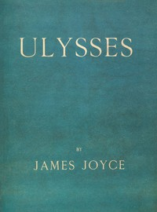

# Ulysses <kbd>4300</kbd>

## Authors

 - Joyce, James <small>(1882 - 1941)</small>

## Subjects

 - Alienation (Social psychology) -- Fiction
 - Artists -- Fiction
 - City and town life -- Fiction
 - Domestic fiction
 - Dublin (Ireland) -- Fiction
 - Epic literature
 - Jewish men -- Fiction
 - Male friendship -- Fiction
 - Married people -- Fiction
 - Psychological fiction

## Download

 - https://www.gutenberg.org/files/4300/4300-h.zip
 - https://www.gutenberg.org/files/4300/4300-h/4300-h.htm
 - https://www.gutenberg.org/cache/epub/4300/pg4300.cover.small.jpg
 - https://www.gutenberg.org/ebooks/4300.html.images
 - https://www.gutenberg.org/files/4300/4300-0.txt
 - https://www.gutenberg.org/ebooks/4300.kindle.images
 - https://www.gutenberg.org/ebooks/4300.epub.images
 - https://www.gutenberg.org/ebooks/4300.rdf

## Book Shelves

 - Banned Books List from the American Library Association
 - Banned Books from Anne Haight's list
 - Best Books Ever Listings
 - Erotic Fiction
