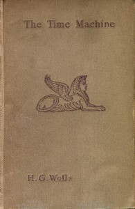

# The Time Machine <kbd>35</kbd>

## Authors

 - Wells, H. G. (Herbert George) <small>(1866 - 1946)</small>

## Subjects

 - Dystopias -- Fiction
 - Science fiction
 - Time travel -- Fiction

## Download

 - https://www.gutenberg.org/files/35/35-h.zip
 - https://www.gutenberg.org/files/35/35-0.zip
 - https://www.gutenberg.org/cache/epub/35/pg35.cover.medium.jpg
 - https://www.gutenberg.org/files/35/35-h/35-h.htm
 - https://www.gutenberg.org/ebooks/35.html.images
 - https://www.gutenberg.org/ebooks/35.kindle.images
 - https://www.gutenberg.org/ebooks/35.rdf
 - https://www.gutenberg.org/ebooks/35.epub.images

## Book Shelves

 - Movie Books
 - Science Fiction
