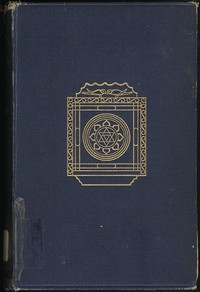

# Omens and Superstitions of Southern India <kbd>35690</kbd>

## Authors

 - Thurston, Edgar <small>(1855 - 1935)</small>

## Subjects

 - Dravidians -- Folklore
 - Folklore -- India
 - Occultism -- India, South
 - Omens
 - Superstition -- India, South

## Download

 - https://www.gutenberg.org/files/35690/35690-h.zip
 - https://www.gutenberg.org/files/35690/35690.zip
 - https://www.gutenberg.org/cache/epub/35690/pg35690.cover.small.jpg
 - https://www.gutenberg.org/files/35690/35690-8.zip
 - https://www.gutenberg.org/files/35690/35690-8.txt
 - https://www.gutenberg.org/ebooks/35690.html.images
 - https://www.gutenberg.org/ebooks/35690.kindle.images
 - https://www.gutenberg.org/ebooks/35690.rdf
 - https://www.gutenberg.org/ebooks/35690.txt.utf-8
 - https://www.gutenberg.org/ebooks/35690.epub.images

## Book Shelves

