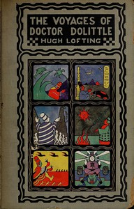

# The Voyages of Doctor Dolittle <kbd>1154</kbd>

## Authors

 - Lofting, Hugh <small>(1886 - 1947)</small>

## Subjects

 - Animals -- Juvenile fiction
 - Fantasy literature
 - Human-animal communication -- Juvenile fiction
 - Voyages and travels -- Juvenile fiction

## Download

 - https://www.gutenberg.org/files/1154/1154-0.txt
 - https://www.gutenberg.org/files/1154/1154-0.zip
 - https://www.gutenberg.org/cache/epub/1154/pg1154.cover.small.jpg
 - https://www.gutenberg.org/files/1154/1154-h/1154-h.htm
 - https://www.gutenberg.org/ebooks/1154.html.images
 - https://www.gutenberg.org/ebooks/1154.rdf
 - https://www.gutenberg.org/ebooks/1154.epub.images
 - https://www.gutenberg.org/ebooks/1154.kindle.images

## Book Shelves

 - Children's Literature
