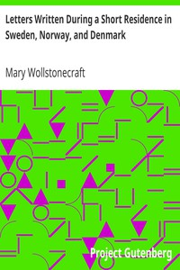

# Letters Written During a Short Residence in Sweden, Norway, and Denmark <kbd>3529</kbd>

## Authors

 - Wollstonecraft, Mary <small>(1759 - 1797)</small>

## Subjects

 - Authors, English -- 18th century -- Correspondence
 - Feminists -- Great Britain -- Correspondence
 - Imlay, Gilbert, 1754?-1828? -- Correspondence
 - Scandinavia -- Description and travel -- Early works to 1800
 - Wollstonecraft, Mary, 1759-1797 -- Correspondence
 - Wollstonecraft, Mary, 1759-1797 -- Travel -- Scandinavia

## Download

 - https://www.gutenberg.org/cache/epub/3529/pg3529.cover.medium.jpg
 - https://www.gutenberg.org/files/3529/3529-h/3529-h.htm
 - https://www.gutenberg.org/files/3529/3529.txt
 - https://www.gutenberg.org/ebooks/3529.txt.utf-8
 - https://www.gutenberg.org/ebooks/3529.kindle.images
 - https://www.gutenberg.org/ebooks/3529.rdf
 - https://www.gutenberg.org/ebooks/3529.epub.images

## Book Shelves

