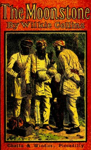

# The Moonstone <kbd>155</kbd>

## Authors

 - Collins, Wilkie <small>(1824 - 1889)</small>

## Subjects

 - Country homes -- Fiction
 - East Indians -- England -- Fiction
 - England -- Fiction
 - Jewelry theft -- Fiction
 - Mystery fiction
 - Police -- England -- Fiction

## Download

 - https://www.gutenberg.org/files/155/155-h/155-h.htm
 - https://www.gutenberg.org/files/155/155-h.zip
 - https://www.gutenberg.org/files/155/155-0.txt
 - https://www.gutenberg.org/cache/epub/155/pg155.cover.small.jpg
 - https://www.gutenberg.org/ebooks/155.html.images
 - https://www.gutenberg.org/ebooks/155.kindle.images
 - https://www.gutenberg.org/ebooks/155.rdf
 - https://www.gutenberg.org/ebooks/155.epub.images

## Book Shelves

 - Detective Fiction
 - Mystery Fiction
