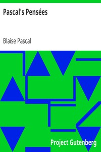

# Pascal's Pensées <kbd>18269</kbd>

## Authors

 - Pascal, Blaise <small>(1623 - 1662)</small>

## Subjects

 - Apologetics
 - Philosophy

## Download

 - https://www.gutenberg.org/files/18269/18269.txt
 - https://www.gutenberg.org/files/18269/18269-8.zip
 - https://www.gutenberg.org/files/18269/18269-h.zip
 - https://www.gutenberg.org/cache/epub/18269/pg18269.cover.medium.jpg
 - https://www.gutenberg.org/files/18269/18269-0.txt
 - https://www.gutenberg.org/ebooks/18269.html.images
 - https://www.gutenberg.org/files/18269/18269-8.txt
 - https://www.gutenberg.org/ebooks/18269.rdf
 - https://www.gutenberg.org/ebooks/18269.epub.images
 - https://www.gutenberg.org/ebooks/18269.kindle.images

## Book Shelves

 - Banned Books from Anne Haight's list
 - Harvard Classics
