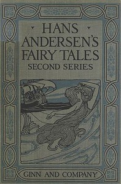

# Hans Andersen's Fairy Tales. Second Series <kbd>32572</kbd>

## Authors

 - Andersen, H. C. (Hans Christian) <small>(1805 - 1875)</small>

## Subjects

 - Children's stories, Danish -- Translations into English
 - Fairy tales
 - Fairy tales -- Denmark

## Download

 - https://www.gutenberg.org/cache/epub/32572/pg32572.cover.small.jpg
 - https://www.gutenberg.org/files/32572/32572-0.txt
 - https://www.gutenberg.org/files/32572/32572-8.txt
 - https://www.gutenberg.org/files/32572/32572-h.zip
 - https://www.gutenberg.org/files/32572/32572-8.zip
 - https://www.gutenberg.org/files/32572/32572.txt
 - https://www.gutenberg.org/ebooks/32572.html.images
 - https://www.gutenberg.org/ebooks/32572.kindle.images
 - https://www.gutenberg.org/ebooks/32572.rdf
 - https://www.gutenberg.org/ebooks/32572.epub.images

## Book Shelves

