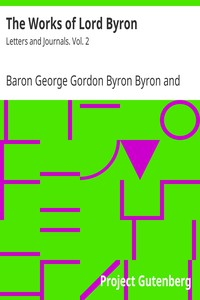

# The Works of Lord Byron: Letters and Journals. Vol. 2 <kbd>9921</kbd>

## Authors

 - Byron, George Gordon Byron, Baron <small>(1788 - 1824)</small>

## Subjects

 - Byron, George Gordon Byron, Baron, 1788-1824 -- Correspondence
 - Byron, George Gordon Byron, Baron, 1788-1824 -- Diaries
 - Poets, English -- 19th century -- Correspondence
 - Poets, English -- 19th century -- Diaries

## Download

 - https://www.gutenberg.org/files/9921/9921-8.zip
 - https://www.gutenberg.org/files/9921/9921.zip
 - https://www.gutenberg.org/files/9921/9921-h/9921-h.htm
 - https://www.gutenberg.org/cache/epub/9921/pg9921.cover.small.jpg
 - https://www.gutenberg.org/ebooks/9921.html.images
 - https://www.gutenberg.org/ebooks/9921.kindle.images
 - https://www.gutenberg.org/ebooks/9921.rdf
 - https://www.gutenberg.org/ebooks/9921.epub.images
 - https://www.gutenberg.org/ebooks/9921.txt.utf-8

## Book Shelves

