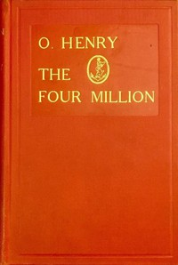

# The Four Million <kbd>2776</kbd>

## Authors

 - Henry, O. <small>(1862 - 1910)</small>

## Subjects

 - New York (N.Y.) -- Social life and customs -- Fiction
 - Short stories, American

## Download

 - https://www.gutenberg.org/ebooks/2776.html.images
 - https://www.gutenberg.org/files/2776/2776-h.zip
 - https://www.gutenberg.org/files/2776/2776-0.txt
 - https://www.gutenberg.org/ebooks/2776.kindle.images
 - https://www.gutenberg.org/ebooks/2776.rdf
 - https://www.gutenberg.org/ebooks/2776.epub.images
 - https://www.gutenberg.org/ebooks/2776.txt.utf-8
 - https://www.gutenberg.org/cache/epub/2776/pg2776.cover.medium.jpg

## Book Shelves

