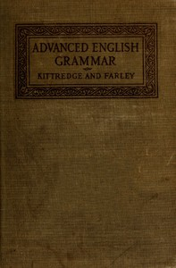

# An Advanced English Grammar with Exercises <kbd>45814</kbd>

## Authors

 - Farley, Frank Edgar <small>(1868 - null)</small>
 - Kittredge, George Lyman <small>(1860 - 1941)</small>

## Subjects

 - English language -- Grammar

## Download

 - https://www.gutenberg.org/cache/epub/45814/pg45814.cover.small.jpg
 - https://www.gutenberg.org/files/45814/45814-h/45814-h.htm
 - https://www.gutenberg.org/files/45814/45814-h.zip
 - https://www.gutenberg.org/ebooks/45814.html.images
 - https://www.gutenberg.org/files/45814/45814-0.txt
 - https://www.gutenberg.org/ebooks/45814.kindle.images
 - https://www.gutenberg.org/ebooks/45814.rdf
 - https://www.gutenberg.org/ebooks/45814.epub.images

## Book Shelves

