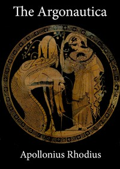

# The Argonautica <kbd>830</kbd>

## Authors

 - Apollonius, Rhodius <small>(null - null)</small>

## Subjects

 - Argonauts (Greek mythology)
 - Classical literature
 - Jason -- (Mythological character)
 - Medea, consort of Aegeus, King of Athens (Mythological character)

## Download

 - https://www.gutenberg.org/files/830/830.zip
 - https://www.gutenberg.org/files/830/830-0.zip
 - https://www.gutenberg.org/files/830/830-0.txt
 - https://www.gutenberg.org/cache/epub/830/pg830.cover.medium.jpg
 - https://www.gutenberg.org/files/830/830-h/830-h.htm
 - https://www.gutenberg.org/ebooks/830.html.images
 - https://www.gutenberg.org/ebooks/830.kindle.images
 - https://www.gutenberg.org/ebooks/830.rdf
 - https://www.gutenberg.org/ebooks/830.epub.images

## Book Shelves

 - Classical Antiquity
