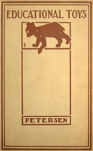

# Educational Toys: Consisting Chiefly of Coping-Saw Problems for Children in School and the Home <kbd>43635</kbd>

## Authors

 - Petersen, Louis Christian <small>(1878 - null)</small>

## Subjects

 - Toys
 - Woodwork

## Download

 - https://www.gutenberg.org/files/43635/43635.zip
 - https://www.gutenberg.org/files/43635/43635-h.zip
 - https://www.gutenberg.org/cache/epub/43635/pg43635.cover.small.jpg
 - https://www.gutenberg.org/ebooks/43635.html.images
 - https://www.gutenberg.org/ebooks/43635.kindle.images
 - https://www.gutenberg.org/ebooks/43635.rdf
 - https://www.gutenberg.org/ebooks/43635.txt.utf-8
 - https://www.gutenberg.org/ebooks/43635.epub.images

## Book Shelves

