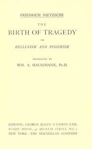

# The Birth of Tragedy; or, Hellenism and Pessimism <kbd>51356</kbd>

## Authors

 - Nietzsche, Friedrich Wilhelm <small>(1844 - 1900)</small>

## Subjects

 - Aesthetics
 - Greek drama (Tragedy) -- History and criticism -- Theory, etc.
 - Music -- Philosophy and aesthetics
 - Mythology, Greek, in literature
 - Tragedy
 - Tragic, The

## Download

 - https://www.gutenberg.org/files/51356/51356-0.txt
 - https://www.gutenberg.org/files/51356/51356-0.zip
 - https://www.gutenberg.org/files/51356/51356-h/51356-h.htm
 - https://www.gutenberg.org/cache/epub/51356/pg51356.cover.medium.jpg
 - https://www.gutenberg.org/ebooks/51356.html.images
 - https://www.gutenberg.org/ebooks/51356.rdf
 - https://www.gutenberg.org/ebooks/51356.epub.images
 - https://www.gutenberg.org/ebooks/51356.kindle.images

## Book Shelves

