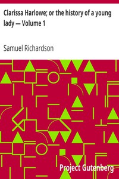

# Clarissa Harlowe; or the history of a young lady — Volume 1 <kbd>9296</kbd>

## Authors

 - Richardson, Samuel <small>(1689 - 1761)</small>

## Subjects

 - Conflict of generations -- Fiction
 - England -- Fiction
 - Epistolary fiction
 - Kidnapping victims -- Fiction
 - Psychological fiction
 - Rape victims -- Fiction
 - Young women -- Crimes against -- Fiction

## Download

 - https://www.gutenberg.org/files/9296/9296-h/9296-h.htm
 - https://www.gutenberg.org/files/9296/9296-0.zip
 - https://www.gutenberg.org/cache/epub/9296/pg9296.cover.small.jpg
 - https://www.gutenberg.org/files/9296/9296-0.txt
 - https://www.gutenberg.org/ebooks/9296.rdf
 - https://www.gutenberg.org/ebooks/9296.kindle.images
 - https://www.gutenberg.org/ebooks/9296.epub.images
 - https://www.gutenberg.org/ebooks/9296.txt.utf-8

## Book Shelves

