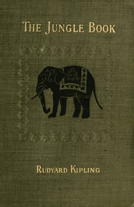

# The Jungle Book <kbd>35997</kbd>

## Authors

 - Kipling, Rudyard <small>(1865 - 1936)</small>

## Subjects

 - Adventure stories, English
 - Animals -- Fiction
 - Feral children -- Fiction
 - India -- Fiction
 - India -- History -- 19th century -- Fiction
 - Jungle animals -- Fiction
 - Jungles -- Fiction
 - Mowgli (Fictitious character) -- Fiction
 - Short stories

## Download

 - https://www.gutenberg.org/ebooks/35997.html.images
 - https://www.gutenberg.org/files/35997/35997-h.zip
 - https://www.gutenberg.org/files/35997/35997-0.zip
 - https://www.gutenberg.org/cache/epub/35997/pg35997.cover.medium.jpg
 - https://www.gutenberg.org/files/35997/35997-0.txt
 - https://www.gutenberg.org/ebooks/35997.epub.images
 - https://www.gutenberg.org/ebooks/35997.rdf
 - https://www.gutenberg.org/ebooks/35997.kindle.images
 - https://www.gutenberg.org/ebooks/35997.txt.utf-8

## Book Shelves

