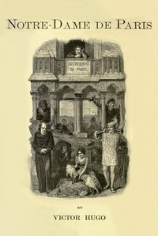

# Notre-Dame de Paris <kbd>2610</kbd>

## Authors

 - Hugo, Victor <small>(1802 - 1885)</small>

## Subjects

 - Clergy -- Fiction
 - France -- History -- Louis XI, 1461-1483 -- Fiction
 - Historical fiction
 - Notre-Dame de Paris (Cathedral) -- Fiction
 - Paris (France) -- History -- To 1515 -- Fiction
 - People with disabilities -- Fiction
 - Romances

## Download

 - https://www.gutenberg.org/cache/epub/2610/pg2610.cover.small.jpg
 - https://www.gutenberg.org/files/2610/2610-h/2610-h.htm
 - https://www.gutenberg.org/files/2610/2610-0.zip
 - https://www.gutenberg.org/files/2610/2610-0.txt
 - https://www.gutenberg.org/ebooks/2610.html.images
 - https://www.gutenberg.org/ebooks/2610.epub.images
 - https://www.gutenberg.org/ebooks/2610.rdf
 - https://www.gutenberg.org/ebooks/2610.kindle.images

## Book Shelves

 - Banned Books from Anne Haight's list
 - Harvard Classics
 - Movie Books
