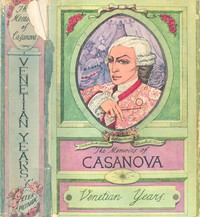

# The Memoirs of Jacques Casanova de Seingalt, 1725-1798. Complete <kbd>2981</kbd>

## Authors

 - Casanova, Giacomo <small>(1725 - 1798)</small>

## Subjects

 - Casanova, Giacomo, 1725-1798
 - Europe -- History -- 18th century -- Biography

## Download

 - https://www.gutenberg.org/files/2981/2981-h.zip
 - https://www.gutenberg.org/files/2981/2981-h/2981-h.htm
 - https://www.gutenberg.org/cache/epub/2981/pg2981.cover.medium.jpg
 - https://www.gutenberg.org/files/2981/2981-0.txt
 - https://www.gutenberg.org/ebooks/2981.html.images
 - https://www.gutenberg.org/ebooks/2981.rdf
 - https://www.gutenberg.org/ebooks/2981.epub.images
 - https://www.gutenberg.org/ebooks/2981.kindle.images

## Book Shelves

 - Banned Books from Anne Haight's list
 - Germany
