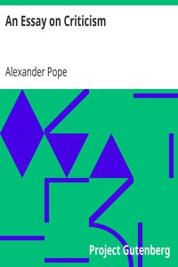

# An Essay on Criticism <kbd>7409</kbd>

## Authors

 - Pope, Alexander <small>(1688 - 1744)</small>

## Subjects

 - Criticism
 - Poetry -- Early works to 1800

## Download

 - https://www.gutenberg.org/files/7409/7409.zip
 - https://www.gutenberg.org/files/7409/7409-h.zip
 - https://www.gutenberg.org/cache/epub/7409/pg7409.cover.medium.jpg
 - https://www.gutenberg.org/ebooks/7409.html.images
 - https://www.gutenberg.org/files/7409/7409.txt
 - https://www.gutenberg.org/ebooks/7409.rdf
 - https://www.gutenberg.org/ebooks/7409.kindle.images
 - https://www.gutenberg.org/ebooks/7409.epub.images
 - https://www.gutenberg.org/ebooks/7409.txt.utf-8

## Book Shelves

