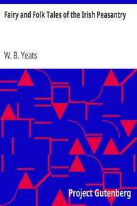

# Fairy and Folk Tales of the Irish Peasantry <kbd>33887</kbd>

## Authors

## Subjects

 - Tales -- Ireland

## Download

 - https://www.gutenberg.org/files/33887/33887-8.txt
 - https://www.gutenberg.org/files/33887/33887-h/music/320-harp-m.mid
 - https://www.gutenberg.org/files/33887/33887-h.zip
 - https://www.gutenberg.org/cache/epub/33887/pg33887.cover.medium.jpg
 - https://www.gutenberg.org/files/33887/33887.txt
 - https://www.gutenberg.org/files/33887/33887-0.txt
 - https://www.gutenberg.org/files/33887/33887-h/33887-h.htm
 - https://www.gutenberg.org/ebooks/33887.html.images
 - https://www.gutenberg.org/ebooks/33887.kindle.images
 - https://www.gutenberg.org/ebooks/33887.rdf
 - https://www.gutenberg.org/ebooks/33887.epub.images

## Book Shelves

