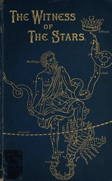

# The Witness of the Stars <kbd>49018</kbd>

## Authors

 - Bullinger, E. W. (Ethelbert William) <small>(1837 - 1913)</small>

## Subjects

 - Astronomy
 - Astronomy in the Bible
 - Bible and science
 - Constellations

## Download

 - https://www.gutenberg.org/files/49018/49018-h/49018-h.html
 - https://www.gutenberg.org/files/49018/49018-0.txt
 - https://www.gutenberg.org/files/49018/49018.zip
 - https://www.gutenberg.org/cache/epub/49018/pg49018.cover.medium.jpg
 - https://www.gutenberg.org/files/49018/49018-8.txt
 - https://www.gutenberg.org/files/49018/49018-tei.zip
 - https://www.gutenberg.org/files/49018/49018-pdf.zip
 - https://www.gutenberg.org/ebooks/49018.html.images
 - https://www.gutenberg.org/ebooks/49018.epub.images
 - https://www.gutenberg.org/ebooks/49018.rdf
 - https://www.gutenberg.org/ebooks/49018.kindle.images
 - https://www.gutenberg.org/files/49018/49018-pdf.pdf
 - https://www.gutenberg.org/files/49018/49018-tei/49018-tei.tei

## Book Shelves

