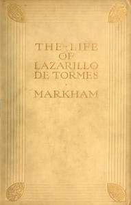

# The Life of Lazarillo de Tormes: His Fortunes & Adversities; with a Notice of the Mendoza Family, a Short Life of the Author, Don Diego Hurtado De Mendoza, a Notice of the Work, and Some Remarks on the Character of Lazarillo de Tormes <kbd>53489</kbd>

## Authors

 - Anonymous <small>(null - null)</small>

## Subjects

 - Picaresque fiction
 - Spanish fiction -- Translations into English

## Download

 - https://www.gutenberg.org/files/53489/53489-0.zip
 - https://www.gutenberg.org/cache/epub/53489/pg53489.cover.medium.jpg
 - https://www.gutenberg.org/files/53489/53489-h.zip
 - https://www.gutenberg.org/ebooks/53489.html.images
 - https://www.gutenberg.org/ebooks/53489.epub.images
 - https://www.gutenberg.org/ebooks/53489.rdf
 - https://www.gutenberg.org/ebooks/53489.kindle.images

## Book Shelves

 - 6 Best Loved Spanish Literary Classics
