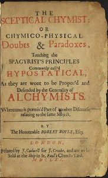

# The Sceptical Chymist: or Chymico-Physical Doubts & Paradoxes, Touching the Spagyrist's Principles Commonly call'd Hypostatical; As they are wont to be Propos'd and Defended by the Generality of Alchymists. Whereunto is præmis'd Part of another Discourse relating to the same Subject. <kbd>22914</kbd>

## Authors

 - Boyle, Robert <small>(1627 - 1691)</small>

## Subjects

 - Chemistry -- Early works to 1800

## Download

 - https://www.gutenberg.org/files/22914/22914-8.zip
 - https://www.gutenberg.org/cache/epub/22914/pg22914.cover.small.jpg
 - https://www.gutenberg.org/files/22914/22914-h.zip
 - https://www.gutenberg.org/files/22914/22914.txt
 - https://www.gutenberg.org/files/22914/22914-8.txt
 - https://www.gutenberg.org/ebooks/22914.html.images
 - https://www.gutenberg.org/ebooks/22914.txt.utf-8
 - https://www.gutenberg.org/ebooks/22914.epub.images
 - https://www.gutenberg.org/ebooks/22914.rdf
 - https://www.gutenberg.org/ebooks/22914.kindle.images

## Book Shelves

 - Chemistry
