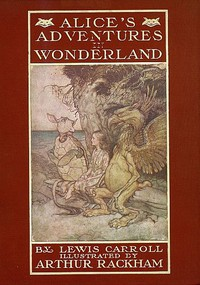

# Alice's Adventures in Wonderland: Illustrated by Arthur Rackham. With a Proem by Austin Dobson <kbd>28885</kbd>

## Authors

 - Carroll, Lewis <small>(1832 - 1898)</small>

## Subjects

 - Alice (Fictitious character from Carroll) -- Juvenile fiction
 - Children's stories
 - Fantasy fiction
 - Imaginary places -- Juvenile fiction

## Download

 - https://www.gutenberg.org/files/28885/28885.zip
 - https://www.gutenberg.org/files/28885/28885-8.zip
 - https://www.gutenberg.org/files/28885/28885-h.zip
 - https://www.gutenberg.org/cache/epub/28885/pg28885.cover.small.jpg
 - https://www.gutenberg.org/files/28885/28885.txt
 - https://www.gutenberg.org/ebooks/28885.html.images
 - https://www.gutenberg.org/ebooks/28885.txt.utf-8
 - https://www.gutenberg.org/ebooks/28885.epub.images
 - https://www.gutenberg.org/ebooks/28885.rdf
 - https://www.gutenberg.org/ebooks/28885.kindle.images

## Book Shelves

 - Banned Books from Anne Haight's list
