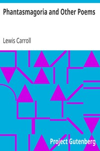

# Phantasmagoria and Other Poems <kbd>651</kbd>

## Authors

 - Carroll, Lewis <small>(1832 - 1898)</small>

## Subjects

 - English poetry -- 19th century
 - Fantasy poetry, English
 - Ghosts -- Poetry

## Download

 - https://www.gutenberg.org/files/651/651-0.txt
 - https://www.gutenberg.org/files/651/651-h.zip
 - https://www.gutenberg.org/cache/epub/651/pg651.cover.medium.jpg
 - https://www.gutenberg.org/ebooks/651.kindle.images
 - https://www.gutenberg.org/ebooks/651.rdf
 - https://www.gutenberg.org/ebooks/651.epub.images

## Book Shelves

