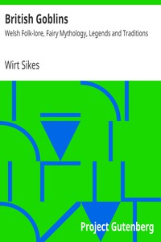

# British Goblins: Welsh Folk-lore, Fairy Mythology, Legends and Traditions <kbd>34704</kbd>

## Authors

 - Sikes, Wirt <small>(1836 - 1883)</small>

## Subjects

 - Folklore -- Wales
 - Goblins -- Wales
 - Mythology, Celtic -- Wales
 - Mythology, Welsh
 - Wales -- Social life and customs

## Download

 - https://www.gutenberg.org/files/34704/34704-h.zip
 - https://www.gutenberg.org/files/34704/34704-8.zip
 - https://www.gutenberg.org/cache/epub/34704/pg34704.cover.medium.jpg
 - https://www.gutenberg.org/files/34704/34704-h/34704-h.htm
 - https://www.gutenberg.org/files/34704/34704.txt
 - https://www.gutenberg.org/ebooks/34704.html.images
 - https://www.gutenberg.org/ebooks/34704.kindle.images
 - https://www.gutenberg.org/ebooks/34704.txt.utf-8
 - https://www.gutenberg.org/ebooks/34704.epub.images
 - https://www.gutenberg.org/ebooks/34704.rdf

## Book Shelves

