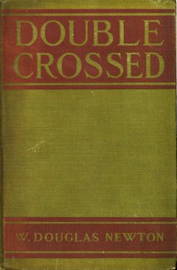

# Double Crossed <kbd>67529</kbd>

## Authors

 - Newton, W. Douglas (Wilfrid Douglas) <small>(1884 - 1951)</small>

## Subjects

 - Adventure stories
 - Canada -- Fiction
 - Conspiracies -- Fiction
 - Heiresses -- Fiction
 - Love stories
 - Ocean liners -- Fiction
 - Young men -- Fiction

## Download

 - https://www.gutenberg.org/files/67529/67529-0.zip
 - https://www.gutenberg.org/ebooks/67529.rdf
 - https://www.gutenberg.org/cache/epub/67529/pg67529.cover.medium.jpg
 - https://www.gutenberg.org/ebooks/67529.kindle.images
 - https://www.gutenberg.org/ebooks/67529.epub.images
 - https://www.gutenberg.org/ebooks/67529.txt.utf-8
 - https://www.gutenberg.org/files/67529/67529-h/67529-h.htm
 - https://www.gutenberg.org/files/67529/67529-0.txt
 - https://www.gutenberg.org/files/67529/67529-h.zip

## Book Shelves

