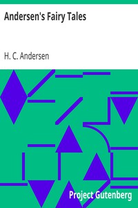

# Andersen's Fairy Tales <kbd>1597</kbd>

## Authors

 - Andersen, H. C. (Hans Christian) <small>(1805 - 1875)</small>

## Subjects

 - Children's stories, Danish -- Translations into English
 - Fairy tales
 - Fairy tales -- Denmark

## Download

 - https://www.gutenberg.org/cache/epub/1597/pg1597.cover.small.jpg
 - https://www.gutenberg.org/files/1597/1597-h/1597-h.htm
 - https://www.gutenberg.org/files/1597/1597-0.zip
 - https://www.gutenberg.org/files/1597/1597-0.txt
 - https://www.gutenberg.org/ebooks/1597.html.images
 - https://www.gutenberg.org/ebooks/1597.rdf
 - https://www.gutenberg.org/ebooks/1597.epub.images
 - https://www.gutenberg.org/ebooks/1597.kindle.images
 - https://www.gutenberg.org/ebooks/1597.txt.utf-8

## Book Shelves

 - Best Books Ever Listings
 - Children's Myths, Fairy Tales, etc.
 - Harvard Classics
