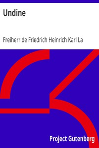

# Undine <kbd>2825</kbd>

## Authors

 - La Motte-Fouqué, Friedrich Heinrich Karl, Freiherr de <small>(1777 - 1843)</small>

## Subjects

 - Fairy tales -- Germany
 - Fantasy fiction
 - Knights and knighthood -- Fiction
 - Love stories
 - Romances -- Translations into English
 - Water spirits -- Fiction

## Download

 - https://www.gutenberg.org/cache/epub/2825/pg2825.cover.small.jpg
 - https://www.gutenberg.org/files/2825/2825-0.zip
 - https://www.gutenberg.org/files/2825/2825-h/2825-h.htm
 - https://www.gutenberg.org/files/2825/2825.txt
 - https://www.gutenberg.org/files/2825/2825-0.txt
 - https://www.gutenberg.org/ebooks/2825.html.images
 - https://www.gutenberg.org/ebooks/2825.rdf
 - https://www.gutenberg.org/ebooks/2825.epub.images
 - https://www.gutenberg.org/ebooks/2825.kindle.images

## Book Shelves

