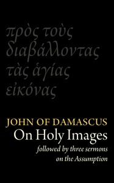

# St John Damascene on Holy Images (πρὸς τοὺς διαβάλλοντας τᾶς ἁγίας εἰκόνας). Followed by Three Sermons on the Assumption (κοίμησις) <kbd>49917</kbd>

## Authors

 - John of Damascus, Saint <small>(675 - 749)</small>

## Subjects

 - Icons -- Cult
 - Idols and images -- Worship
 - Mary, Blessed Virgin, Saint -- Assumption -- Sermons -- Early works to 1800

## Download

 - https://www.gutenberg.org/files/49917/49917.txt
 - https://www.gutenberg.org/files/49917/49917-0.txt
 - https://www.gutenberg.org/files/49917/49917-h.zip
 - https://www.gutenberg.org/files/49917/49917-8.txt
 - https://www.gutenberg.org/files/49917/49917-0.zip
 - https://www.gutenberg.org/cache/epub/49917/pg49917.cover.small.jpg
 - https://www.gutenberg.org/ebooks/49917.rst.gen
 - https://www.gutenberg.org/ebooks/49917.html.images
 - https://www.gutenberg.org/ebooks/49917.pdf.images
 - https://www.gutenberg.org/ebooks/49917.epub.images
 - https://www.gutenberg.org/ebooks/49917.rdf
 - https://www.gutenberg.org/ebooks/49917.kindle.images

## Book Shelves

