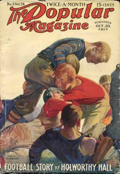

# Troubled Waters <kbd>67550</kbd>

## Authors

 - Sinclair, Bertrand W. <small>(1881 - 1972)</small>

## Subjects

 - British Columbia -- Fiction
 - Loggers -- Fiction
 - Man-woman relationships -- Fiction
 - Triangles (Interpersonal relations) -- Fiction

## Download

 - https://www.gutenberg.org/files/67550/67550-0.zip
 - https://www.gutenberg.org/files/67550/67550-h/67550-h.htm
 - https://www.gutenberg.org/files/67550/67550-0.txt
 - https://www.gutenberg.org/ebooks/67550.txt.utf-8
 - https://www.gutenberg.org/ebooks/67550.epub.images
 - https://www.gutenberg.org/files/67550/67550-h.zip
 - https://www.gutenberg.org/ebooks/67550.kindle.images
 - https://www.gutenberg.org/cache/epub/67550/pg67550.cover.medium.jpg
 - https://www.gutenberg.org/ebooks/67550.rdf

## Book Shelves

