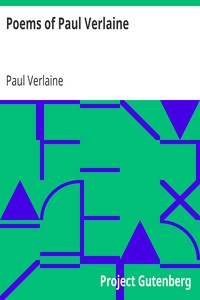

# Poems of Paul Verlaine <kbd>8426</kbd>

## Authors

 - Verlaine, Paul <small>(1844 - 1896)</small>

## Subjects

 - French poetry -- Translations into English

## Download

 - https://www.gutenberg.org/files/8426/8426-8.txt
 - https://www.gutenberg.org/cache/epub/8426/pg8426.cover.small.jpg
 - https://www.gutenberg.org/files/8426/8426-h/8426-h.htm
 - https://www.gutenberg.org/files/8426/8426.zip
 - https://www.gutenberg.org/files/8426/8426.txt
 - https://www.gutenberg.org/ebooks/8426.html.images
 - https://www.gutenberg.org/ebooks/8426.rdf
 - https://www.gutenberg.org/ebooks/8426.txt.utf-8
 - https://www.gutenberg.org/ebooks/8426.kindle.images
 - https://www.gutenberg.org/ebooks/8426.epub.images

## Book Shelves

