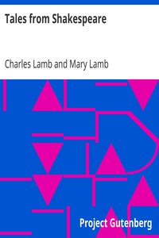

# Tales from Shakespeare <kbd>573</kbd>

## Authors

 - Lamb, Charles <small>(1775 - 1834)</small>
 - Lamb, Mary <small>(1764 - 1847)</small>

## Subjects

 - Shakespeare, William, 1564-1616 -- Adaptations
 - Shakespeare, William, 1564-1616 -- Stories, plots, etc. -- Juvenile literature

## Download

 - https://www.gutenberg.org/cache/epub/573/pg573.cover.small.jpg
 - https://www.gutenberg.org/files/573/573-0.zip
 - https://www.gutenberg.org/ebooks/573.html.images
 - https://www.gutenberg.org/files/573/573-h.zip
 - https://www.gutenberg.org/files/573/573-0.txt
 - https://www.gutenberg.org/ebooks/573.kindle.images
 - https://www.gutenberg.org/ebooks/573.txt.utf-8
 - https://www.gutenberg.org/ebooks/573.rdf
 - https://www.gutenberg.org/ebooks/573.epub.images

## Book Shelves

