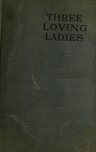

# Three Loving Ladies <kbd>67610</kbd>

## Authors

 - Dowdall, Mrs. <small>(1876 - 1939)</small>

## Subjects

 - City and town life -- Fiction
 - England -- Social conditions -- 20th century -- Fiction
 - England -- Social life and customs -- 20th century -- Fiction
 - Families -- Fiction
 - Marriage -- Fiction
 - Social classes -- Fiction

## Download

 - https://www.gutenberg.org/ebooks/67610.rdf
 - https://www.gutenberg.org/ebooks/67610.epub.images
 - https://www.gutenberg.org/ebooks/67610.txt.utf-8
 - https://www.gutenberg.org/ebooks/67610.kindle.images
 - https://www.gutenberg.org/cache/epub/67610/pg67610.cover.medium.jpg
 - https://www.gutenberg.org/files/67610/67610-0.zip
 - https://www.gutenberg.org/files/67610/67610-h/67610-h.htm
 - https://www.gutenberg.org/files/67610/67610-h.zip
 - https://www.gutenberg.org/files/67610/67610-0.txt

## Book Shelves

