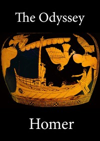

# The Odyssey of Homer <kbd>1728</kbd>

## Authors

 - Homer <small>(-750 - -650)</small>

## Subjects

 - Epic poetry, Greek -- Translations into English
 - Homer -- Translations into English
 - Odysseus, King of Ithaca (Mythological character)

## Download

 - https://www.gutenberg.org/files/1728/1728-h.zip
 - https://www.gutenberg.org/files/1728/1728-0.zip
 - https://www.gutenberg.org/cache/epub/1728/pg1728.cover.medium.jpg
 - https://www.gutenberg.org/files/1728/1728.txt
 - https://www.gutenberg.org/ebooks/1728.html.images
 - https://www.gutenberg.org/files/1728/1728-h/1728-h.htm
 - https://www.gutenberg.org/ebooks/1728.rdf
 - https://www.gutenberg.org/ebooks/1728.epub.images
 - https://www.gutenberg.org/ebooks/1728.kindle.images

## Book Shelves

 - Classical Antiquity
 - Harvard Classics
