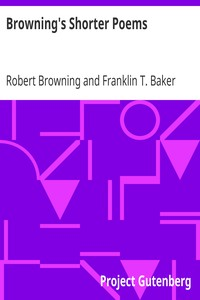

# Browning's Shorter Poems <kbd>16376</kbd>

## Authors

 - Browning, Robert <small>(1812 - 1889)</small>

## Subjects

 - English poetry

## Download

 - https://www.gutenberg.org/files/16376/16376.zip
 - https://www.gutenberg.org/cache/epub/16376/pg16376.cover.medium.jpg
 - https://www.gutenberg.org/files/16376/16376.txt
 - https://www.gutenberg.org/files/16376/16376-8.txt
 - https://www.gutenberg.org/files/16376/16376-h/16376-h.htm
 - https://www.gutenberg.org/ebooks/16376.html.images
 - https://www.gutenberg.org/ebooks/16376.txt.utf-8
 - https://www.gutenberg.org/ebooks/16376.epub.images
 - https://www.gutenberg.org/ebooks/16376.rdf
 - https://www.gutenberg.org/ebooks/16376.kindle.images

## Book Shelves

