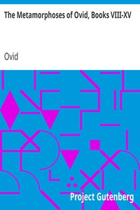

# The Metamorphoses of Ovid, Books VIII-XV <kbd>26073</kbd>

## Authors

 - Ovid <small>(-43 - 17)</small>

## Subjects

 - Classical literature
 - Fables, Latin -- Translations into English
 - Latin poetry -- Translations into English
 - Metamorphosis -- Mythology -- Poetry
 - Mythology, Classical -- Poetry

## Download

 - https://www.gutenberg.org/ebooks/26073.html.images
 - https://www.gutenberg.org/files/26073/26073.txt
 - https://www.gutenberg.org/files/26073/26073-h/26073-h.htm
 - https://www.gutenberg.org/files/26073/26073-0.zip
 - https://www.gutenberg.org/files/26073/26073-8.zip
 - https://www.gutenberg.org/cache/epub/26073/pg26073.cover.medium.jpg
 - https://www.gutenberg.org/files/26073/26073-0.txt
 - https://www.gutenberg.org/ebooks/26073.kindle.images
 - https://www.gutenberg.org/ebooks/26073.rdf
 - https://www.gutenberg.org/ebooks/26073.epub.images

## Book Shelves

 - Best Books Ever Listings
