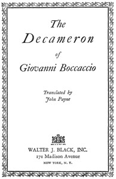

# The Decameron of Giovanni Boccaccio <kbd>23700</kbd>

## Authors

 - Boccaccio, Giovanni <small>(1313 - 1375)</small>

## Subjects

 - Allegories
 - Frame-stories
 - Plague -- Europe -- History -- Fiction
 - Storytelling -- Fiction

## Download

 - https://www.gutenberg.org/cache/epub/23700/pg23700.cover.medium.jpg
 - https://www.gutenberg.org/files/23700/23700-0.zip
 - https://www.gutenberg.org/files/23700/23700-h/23700-h.htm
 - https://www.gutenberg.org/files/23700/23700-h.zip
 - https://www.gutenberg.org/files/23700/23700-0.txt
 - https://www.gutenberg.org/ebooks/23700.txt.utf-8
 - https://www.gutenberg.org/ebooks/23700.epub.images
 - https://www.gutenberg.org/ebooks/23700.kindle.images
 - https://www.gutenberg.org/ebooks/23700.rdf

## Book Shelves

 - Best Books Ever Listings
