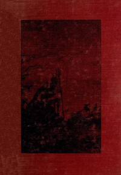

# Witchcraft and Superstitious Record in the South-Western District of Scotland <kbd>43966</kbd>

## Authors

 - Wood, J. Maxwell (John Maxwell) <small>(null - 1925)</small>

## Subjects

 - Folklore -- Scotland
 - Witchcraft -- Scotland

## Download

 - https://www.gutenberg.org/cache/epub/43966/pg43966.cover.small.jpg
 - https://www.gutenberg.org/files/43966/43966-8.txt
 - https://www.gutenberg.org/files/43966/43966-h/43966-h.htm
 - https://www.gutenberg.org/files/43966/43966.zip
 - https://www.gutenberg.org/ebooks/43966.html.images
 - https://www.gutenberg.org/ebooks/43966.rdf
 - https://www.gutenberg.org/ebooks/43966.kindle.images
 - https://www.gutenberg.org/ebooks/43966.txt.utf-8
 - https://www.gutenberg.org/ebooks/43966.epub.images

## Book Shelves

