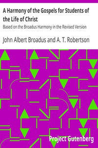

# A Harmony of the Gospels for Students of the Life of Christ: Based on the Broadus Harmony in the Revised Version <kbd>36264</kbd>

## Authors

 - Robertson, A. T. <small>(1863 - 1934)</small>
 - Broadus, John Albert <small>(1827 - 1895)</small>

## Subjects

 - Bible. Gospels -- Harmonies

## Download

 - https://www.gutenberg.org/files/36264/36264.zip
 - https://www.gutenberg.org/files/36264/36264-8.txt
 - https://www.gutenberg.org/files/36264/36264-h/36264-h.htm
 - https://www.gutenberg.org/cache/epub/36264/pg36264.cover.small.jpg
 - https://www.gutenberg.org/files/36264/36264.txt
 - https://www.gutenberg.org/ebooks/36264.html.images
 - https://www.gutenberg.org/ebooks/36264.txt.utf-8
 - https://www.gutenberg.org/ebooks/36264.epub.images
 - https://www.gutenberg.org/ebooks/36264.rdf
 - https://www.gutenberg.org/ebooks/36264.kindle.images

## Book Shelves

