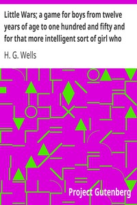

# Little Wars; a game for boys from twelve years of age to one hundred and fifty and for that more intelligent sort of girl who likes boys' games and books. <kbd>3691</kbd>

## Authors

 - Wells, H. G. (Herbert George) <small>(1866 - 1946)</small>

## Subjects

 - War games

## Download

 - https://www.gutenberg.org/cache/epub/3691/pg3691.cover.medium.jpg
 - https://www.gutenberg.org/files/3691/3691.zip
 - https://www.gutenberg.org/files/3691/3691.txt
 - https://www.gutenberg.org/files/3691/3691-h.zip
 - https://www.gutenberg.org/ebooks/3691.html.images
 - https://www.gutenberg.org/ebooks/3691.kindle.images
 - https://www.gutenberg.org/ebooks/3691.rdf
 - https://www.gutenberg.org/ebooks/3691.txt.utf-8
 - https://www.gutenberg.org/ebooks/3691.epub.images

## Book Shelves

