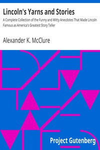

# Lincoln's Yarns and Stories: A Complete Collection of the Funny and Witty Anecdotes That Made Lincoln Famous as America's Greatest Story Teller <kbd>2517</kbd>

## Authors

 - McClure, Alexander K. (Alexander Kelly) <small>(1828 - 1909)</small>

## Subjects

 - Lincoln, Abraham, 1809-1865 -- Anecdotes

## Download

 - https://www.gutenberg.org/files/2517/2517-h.zip
 - https://www.gutenberg.org/files/2517/2517-0.zip
 - https://www.gutenberg.org/cache/epub/2517/pg2517.cover.medium.jpg
 - https://www.gutenberg.org/files/2517/2517-0.txt
 - https://www.gutenberg.org/files/2517/2517.txt
 - https://www.gutenberg.org/ebooks/2517.html.images
 - https://www.gutenberg.org/ebooks/2517.rdf
 - https://www.gutenberg.org/ebooks/2517.epub.images
 - https://www.gutenberg.org/ebooks/2517.kindle.images

## Book Shelves

