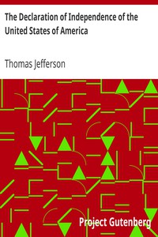

# The Declaration of Independence of the United States of America <kbd>1</kbd>

## Authors

 - Jefferson, Thomas <small>(1743 - 1826)</small>

## Subjects

 - United States -- History -- Revolution, 1775-1783 -- Sources
 - United States. Declaration of Independence

## Download

 - https://www.gutenberg.org/files/1/1-h/1-h.htm
 - https://www.gutenberg.org/cache/epub/1/pg1.cover.medium.jpg
 - https://www.gutenberg.org/files/1/1-0.txt
 - https://www.gutenberg.org/ebooks/1.kindle.images
 - https://www.gutenberg.org/ebooks/1.txt.utf-8
 - https://www.gutenberg.org/ebooks/1.rdf
 - https://www.gutenberg.org/ebooks/1.epub.images

## Book Shelves

 - American Revolutionary War
 - Politics
 - United States Law
